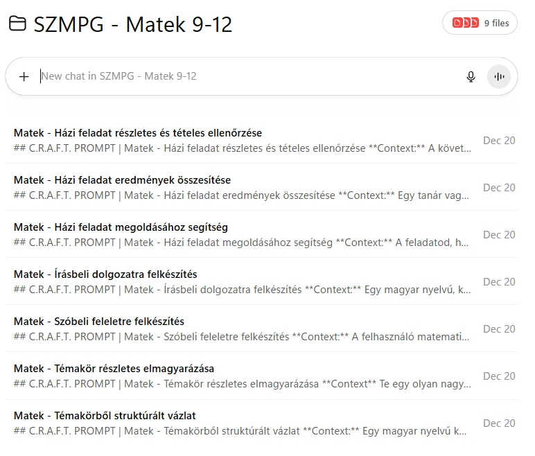
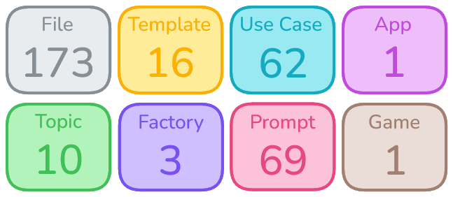

# Univerzális AI Keretrendszer

Az Univerzális AI Keretrendszer egy olyan „túlélőkészlet” a ChatGPT-hez és a generatív AI-hoz, amely bemutatja, hogy az AI-t érdemes rendszerszerűen használni, mert így lesz belőle ténylegesen tanulást és munkát hatékonyan segítő eszköz.

Az Univerzális AI Keretrendszer azoknak készült, akik nem csak kipróbálni akarják a ChatGPT-t, hanem tényleg használni: tanuláshoz, felkészüléshez, rendszerezéshez, ötleteléshez, vagy akár komolyabb projektek megvalósításához.

## Univerzális AI Keretrendszer tervezésének szempontjai
- Általánosan és széles körben felhasználható legyen
- Bármely AI szolgáltatásra alkalmazható legyen
- Tetszőleges prompt keretrendszer integrálhatósága
- Újrafelhasználható komponenseket tartalmazzon
- Rugalmasan bővíthető legyen (saját Use Case)
- Egyedi igények alapján továbbfejleszthető legyen

## Felhasználók köre
- Gyakorlatilag bárki, nincs limitáció
- Diákok és tanárok (gimnázium)
- Hallgatók és oktatók (egyetem)
- Felnőttek (munka célra)
- Felnőttek (személyes célra)

## Univerzális AI Keretrendszer számokban

## Univerzális AI Keretrendszer Könyvtárstruktúra

| Könyvtár | Leírás |
| :--- | :---       |
| 01 Prezentáció | Univerzális AI Keretrendszer prezentációját tartalmazza. |
| 02 Elmélet & Gyakorlat | Az Univerzális AI Keretrendszerhez kidolgozott oktatási dokumentumot tartalmazza. |
| 03 Use Case | Az Univerzális AI Keretrendszerhez aktuálisan kidolgozott témaköröket (tantárgyakat) és hozzájuk tartozó felhasználói eseteket tartalmazza:   - Azonnal használható Use Case promptok (txt fájl)   - Use Case prompt legyártásához szükséges instrukciókat leíró MS word dokumentumokat tartalmazza. |
| 04 Number Guess Game | Az Univerzális AI Keretrendszeren belül implementált klasszikus számkitaláló játék: chatGPT-ben implementált pszeudó programkód (prompt, txt fájl) |
| 05 Template | Az Univerzális AI Keretrendszerhez kidolgozott template dokumentumokat tartalmazza:   - Template - Use Case Promptot.   - A tantárgyaknál használt Use Case prompt template fájlokat.   - Template - Use Case Prompt Factory-t.   - A tantárgyaknál használt Use Case prompt legyártásához szükséges instrukciókat tartalmazó dokumentumokat. |
| 06 Prompt | Az Univerzális AI Keretrendszeren belül használt system promptokat tartalmazza:   - System prompt (chatGPT alap system prompt)   - System_Prompt, System_Prompt_1500   - Az eredeti system prompt   - chatGPT korlátjának megfelelően 1500 karakteres változat   - Meta Prompt - Prompt Factory (CRAFT, COSTAR, COSTARPC)   - A CRAFT prompt keretrendszer alapján kidolgozott, prompt gyártó meta prompt, amely használatával az egyes Use Case promptok legyárthatók, az adott Use Case-hez tartozó instrukciók alapján. |
| 07 QR Code | Az Univerzális AI Keretrendszer letöltési információit tartalmazó QR kódok |
| READ_ME.txt | Az Univerzális AI Keretrendszer áttekintő leírását, a könyvtár- és fájlstruktúráját tartalmazó  dokumentum, amely strukturáltan tartalmazza az Az Univerzális AI Keretrendszert felépítő könyvtár- és fájlhierarchiát |

